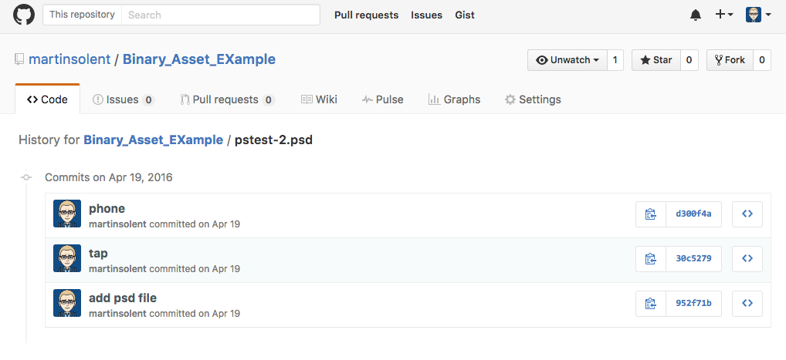
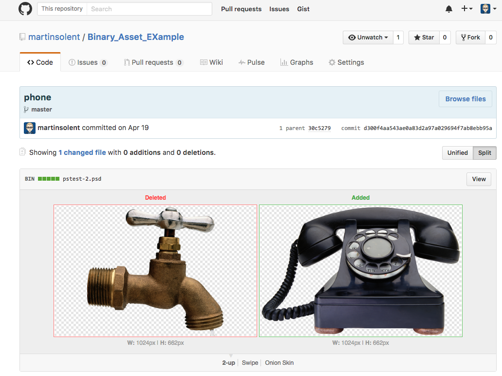
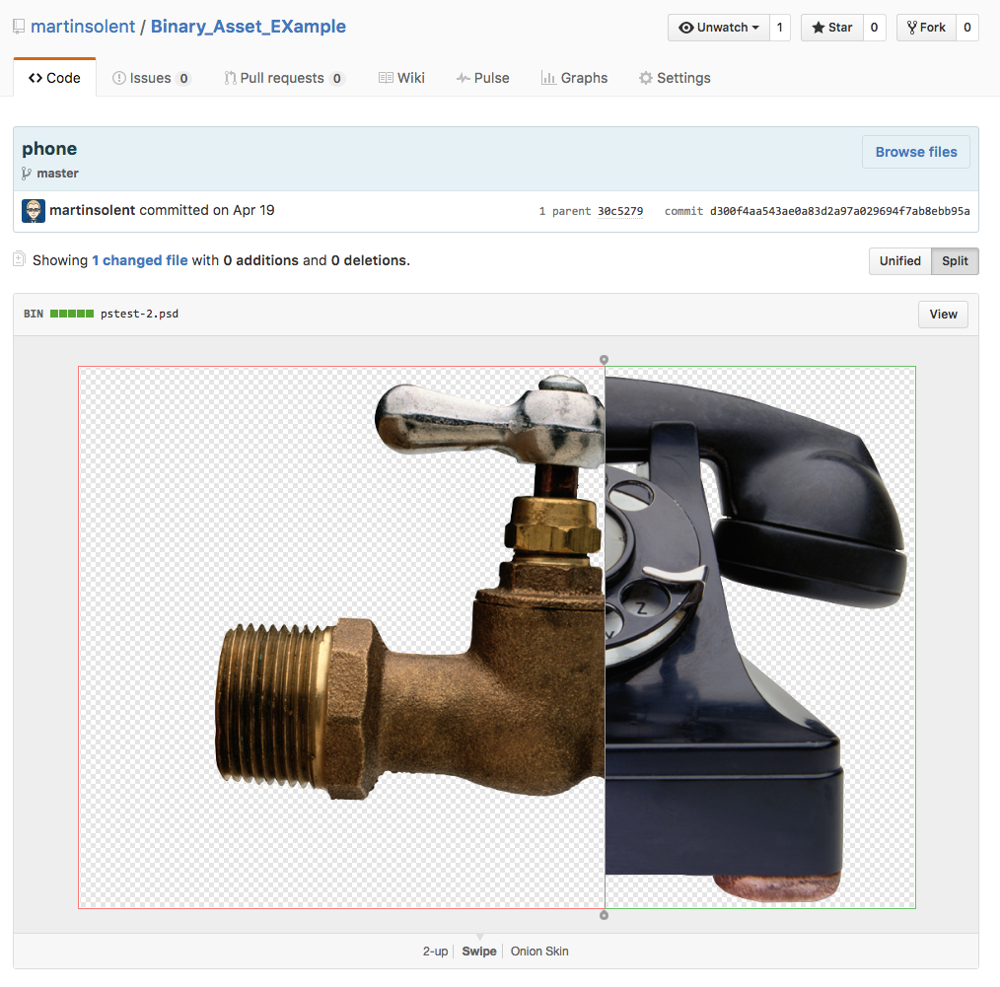
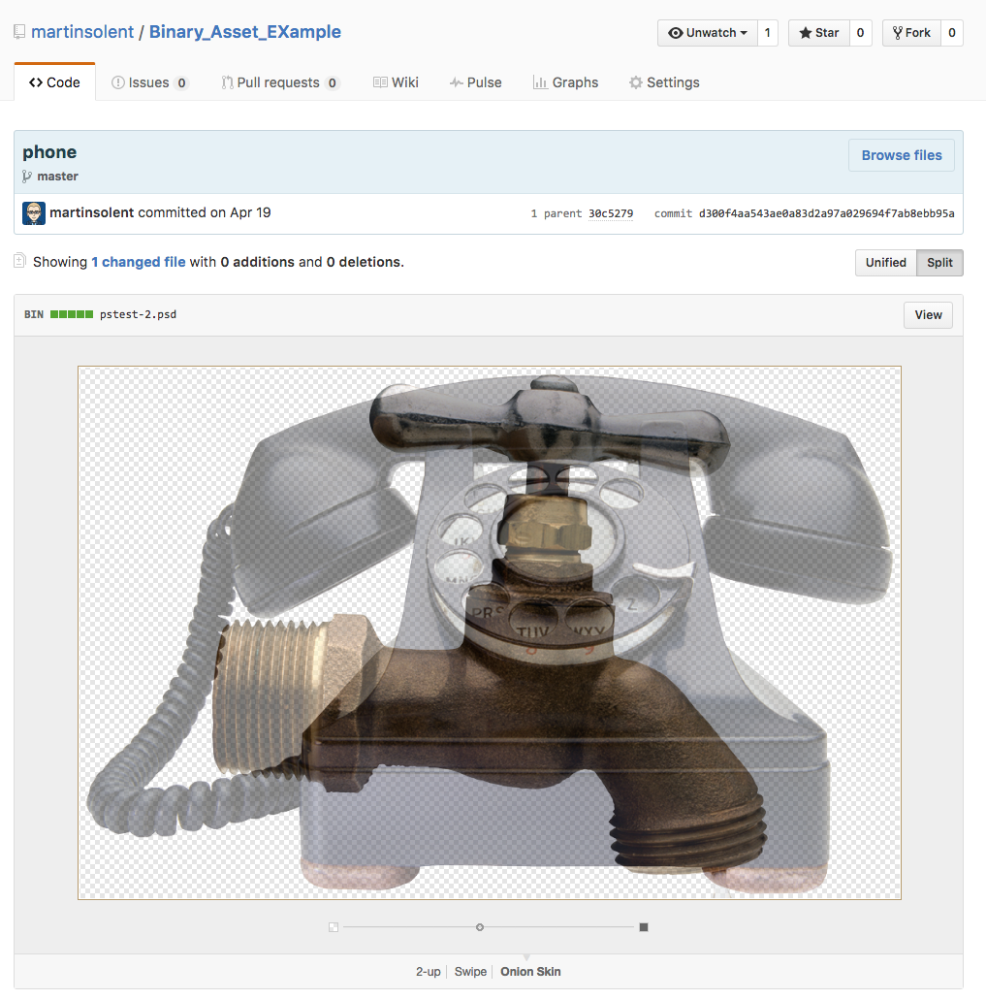

# Binary Asset Example
### Adobe Photoshop (PSD) layered document
 An example of how an image file can be put under version control with GIT,  in this case a Adobe Photoshop (PSD) layered document
 
#### GitHub Commit History - List

#### GitHub Commit History - 2-UP

#### GitHub Commit History - Swipe

#### GitHub Commit History - Onion Skin
